# Embedded, Baremetal, CSS Flexbox (in Ada)

AdaCore wants to demonstrate that their toolset and technologies can be used to implement complex software systems (like Flexbox) in resource-constrained environments (like a bare metal microcontroller). By demonstrating this, AdaCore can showcase Ada’s versatility to AdaCore and the wider Ada programming community, which will give AdaCore more deliverables for their current customer base and expand AdaCore’s existing clientele.

AdaCore additionally wants to advertise the Ada programming language to a wider audience. The industry perception is generally negative with regards to Ada. Many companies relegate Ada to the dustbin of history, with only legacy code and defense contractors running the language. By showcasing the abilities of Ada through a popular delivery means, AdaCore can reach more customers with their products.


## Authors

- [Stuart Walters](https://github.com/sewalters)
- [Kien Nguyen](https://github.com/KNguyen5256)
- [John Shimer](https://github.com/Utavon)
- [Dominick Carlucci](https://github.com/DomCarl)

## Acknowledgements

 - Dr. Naseem Ibrahim
 - Olivier Henley
 - [AdaCore](https://www.adacore.com)
 - [Penn State College of Engineering](https://www.psu.edu)

## How to Setup Environment
### The set-up instructions make the following assumptions: 
    Users are working in a Windows environment.
    Users know and have already set up a new 64-bit Ubuntu v20.04 virtual machine (VM).
    Users are familiar with terminal commands.
    Users know how to use Git.
### To begin setting the development environment for DUI:
1. In Figure 1, on the left-hand side of the Ubuntu VM screen, click and open the Firefox browser.
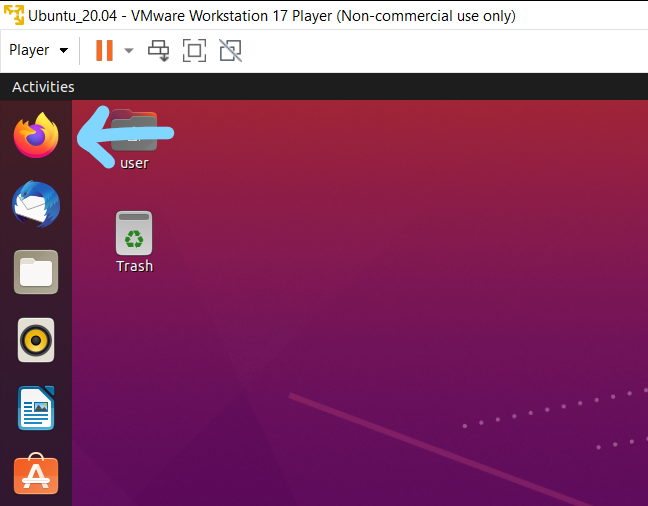
2. As shown in Figure 2, go to https://alire.ada.dev/ and click "Download Alire for Linux" for a .zip file.
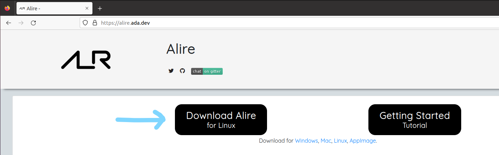
3. Minimize Firefox and click on the grid of nine squares in the bottom left corner of the screen as shown in Figure 3.  
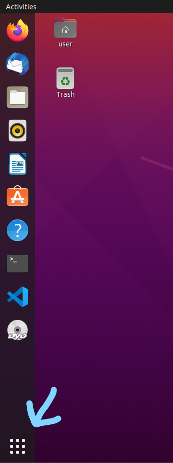
4. Find and open the Terminal application which is circled in Figure 4.
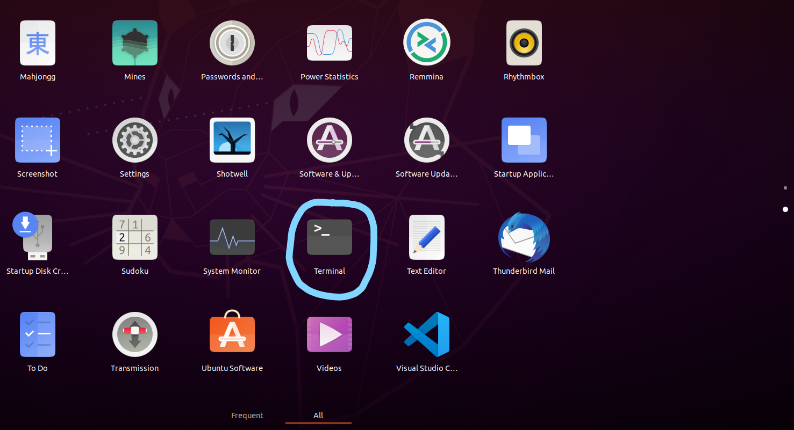
5. Inside the terminal, run ```sudo apt install build-essential```           
6. Run ```mkdir alire_directory``` to create a directory; you can name the directory whatever you want.
7. Do ```cd Downloads``` and you should be in the same directory as the downloaded .zip file; see Figure 5 for an example.
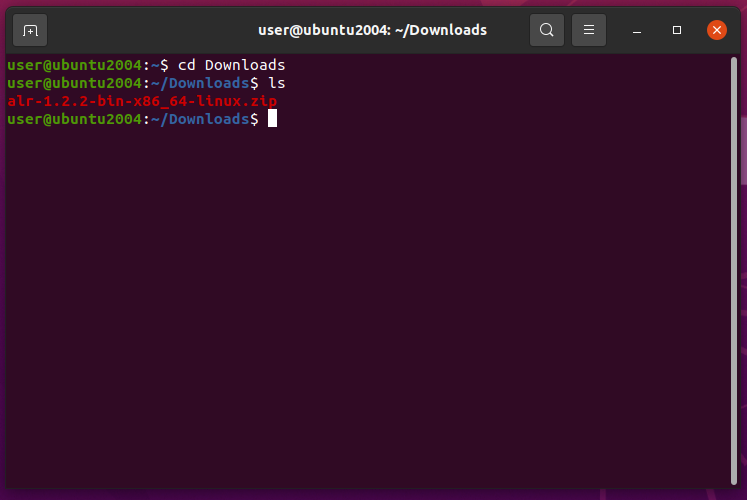
8. Run ```unzip [zip_folder] -d [alire_directory]```, replacing [zip_folder] and [alire_directory] appropriately; make sure to use the absolute path form of the directory (e.g., “/home/user/alire_directory”).  
9. Do ```cd ..``` and then run ```gedit ~/.bashrc``` to open a text editor.  
10. Scroll to the bottom of the file and type on a new line at the end of file ```export PATH="/home/[username]/[alire_directory]/bin:$PATH"```, replacing the bracketed words appropriately; refer to Figure 6 for an example.  
    1. You may need to resize the text editor with the Restore/Maximize button (which is next to the red X button in the top right as depicted in Figure 6a) to fully scroll to the bottom.
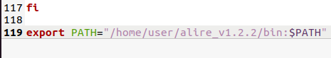
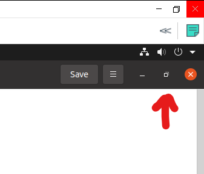
11. Click the “Save” button on the top right as shown in Figure 7 and then close the text editor.
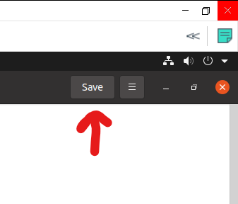
12. Back in the terminal, do ```source ~/.bashrc``` and then do ```which alr``` which should return the directory you entered into .bashrc plus “/alr” as displayed similarly in Figure 8.
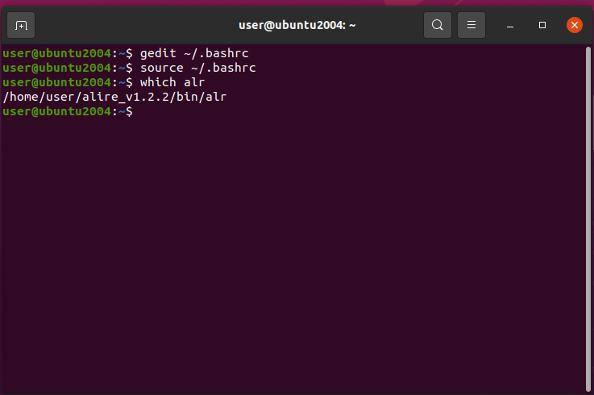
13. Run ```alr toolchain --select```.  
14. Follow the instructions that appear in the terminal to install “gnat_native” version 13.1.0 and “gprbuild” version 22.0.1; you should have something similar to Figure 9.
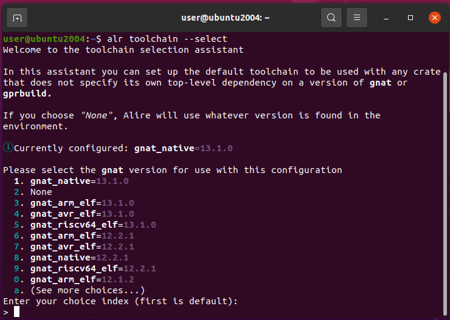
15. Once those installations are finished, do ```cd /home/[username]/.config/alire/cache/dependencies```.  
16. Run ```ls``` and you should see two directories that contain the “gnat_native” and “gprbuild” versions you installed; the results of this step and the previous step are shown in Figure 10.
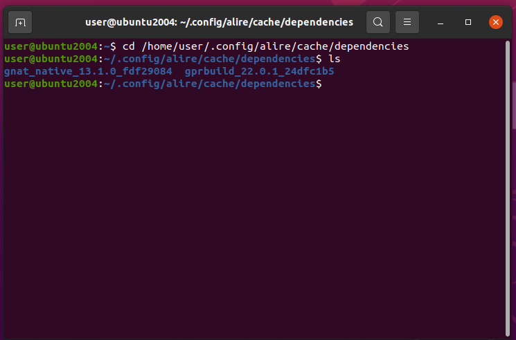
17. Do ```cd $HOME``` and run ```gedit ~/.bashrc``` again.
18. Update the line you entered beforehand as such: ```export PATH="/home/[username]/[alire_directory]/bin:/home/[username]/.config/alire/cache/dependencies/[gnat_native_directory]/bin:/home/[username]/.config/alire/cache/dependencies/[gprbuild_directory]/bin:$PATH"```, replacing the bracketed text with the appropriate directory names; refer to Figure 11 for an example.
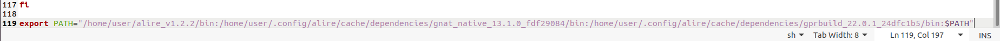
19. Click “Save” and close out of the text editor.  
20. Run ```source ~/.bashrc``` once more.  
21. Do ```which alr```, ```which gnat```, and ```which gprbuild``` to confirm that each command returns their respective directories that were entered into .bashrc plus their command names; you can compare your results with the example in Figure 12.
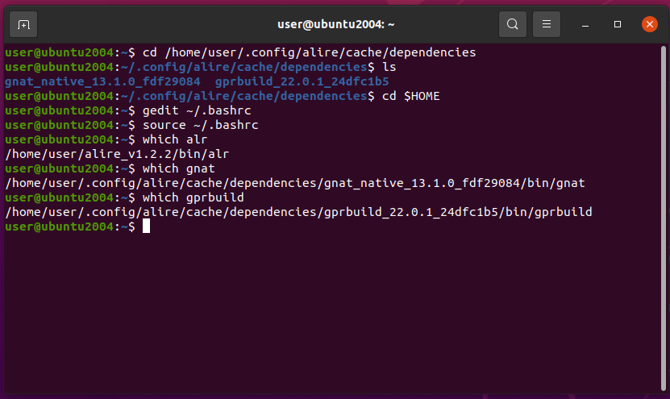
22. Run ```sudo snap install --classic code``` to install VS Code.  
23. Once installed, go to the application grid in the bottom left and open up VS Code which is circled in Figure 13.
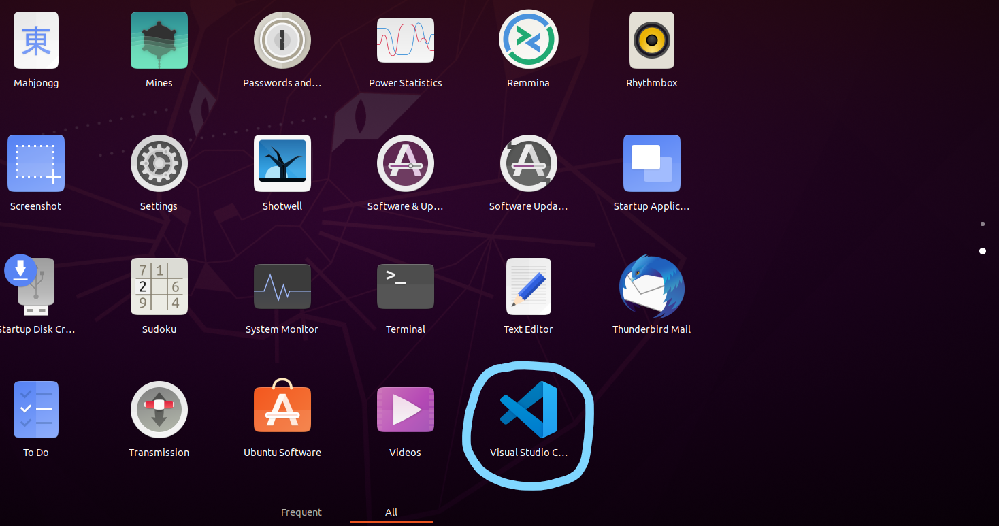
24. On the left-hand side, click on the Extensions tab (denoted by the four-square icon and shown in Figure 14).
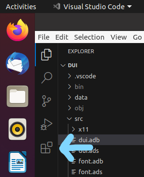
25. In the search bar, find and install these extensions: ```Ada & SPARK``` and ```CodeLLDB``` as shown in Figure 15 and Figure 15a respectively.  
    1. Installing the Ada extension will also install ```C/C++```.
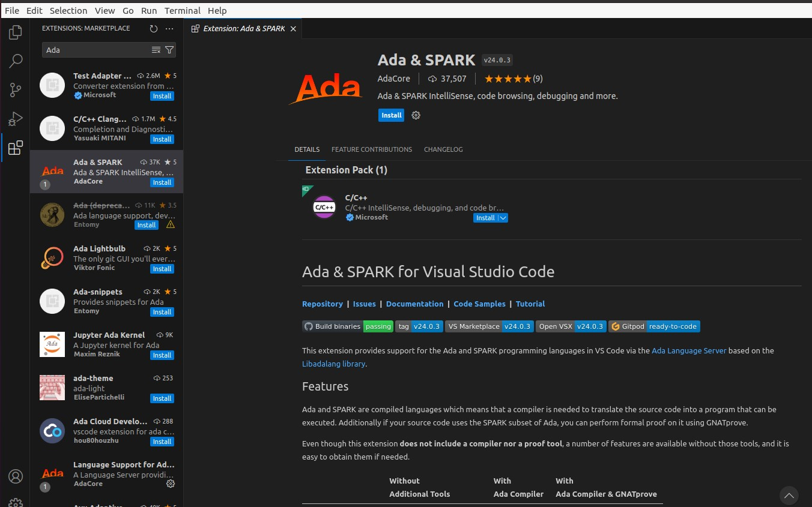
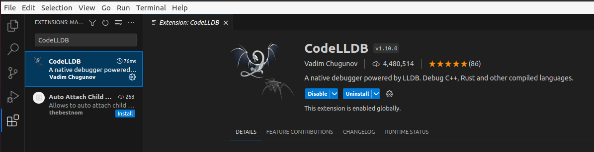
26. Once the extensions are installed, close out of VS Code and return to the terminal.  
27. Do ```sudo apt install git```.  
28. In Figure 16, return to Firefox, go to https://github.com/ohenley/dui, and follow the instructions of the README.md in that repository.
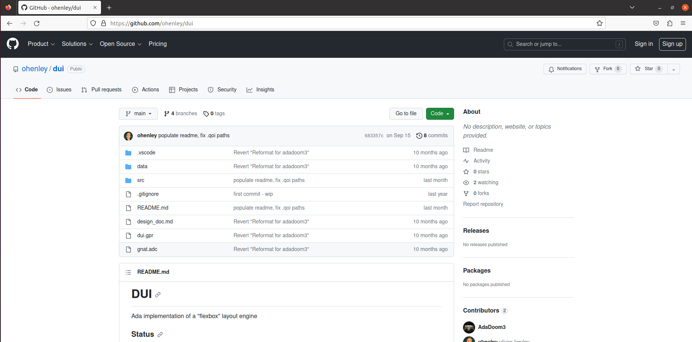


## Instructions for System Deployment

The instructions for deploying the DUI engine onto an embedded system, specifically the STM32F746 microcontroller system, assume the following:  
    - The user has followed all the steps in "How to Setup Environment" and is able to view the source code within VS Code.  
    - The user has a basic understanding of the Ada programming language.

### System Installation

The subsequent steps are targeted to start deploying and developing code on the STM32F7 discovery board. These steps also assume that the previous steps have been completed and that all skills used to complete the previous steps have been carried over.

1. On your VM, find and open the Terminal.
2. Type out the following command: ```alr index --add git+https://github.com/GNAT-Academic-Program/alire-index --name gap``` as shown in Figure 17. Once it is typed up, press “Enter”.
    1. Once you are done with the project, enter ```alr index --del gap```
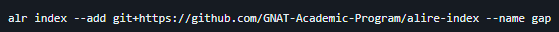
3. Next, type the command ```sudo apt install openocd``` as depicted in Figure 18 to install OpenOCD. Press “Enter” once it is typed out.  
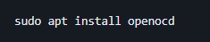
4. Run ```alr toolchain --select``` and install ```gnat_arm_elf``` version ```12.2.1``` and select ```none``` for the gprbuild.  
5. Now, plug in your STM32F7 discovery board using a USB MINI B cable into your computer (See below in Figure 19).
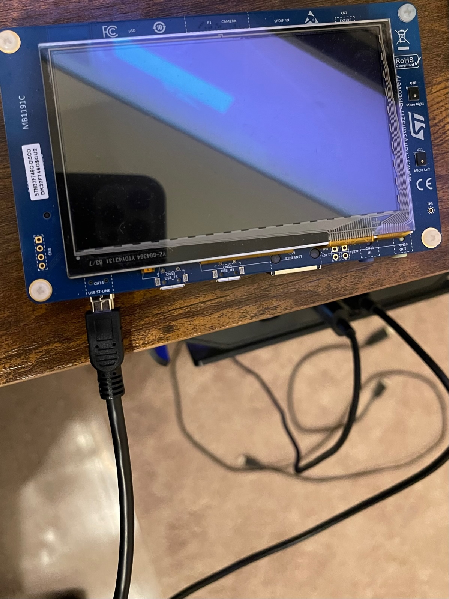
6. In Figure 20, you will receive a prompt on your VM asking which machine you would like the device to connect to. Select the “Connect to a virtual machine” radio button and click “OK”.
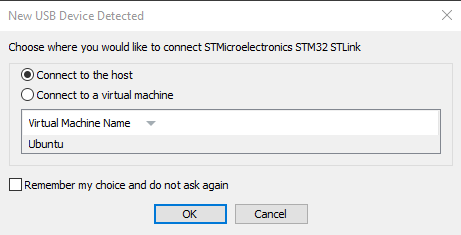
7. Then, clone the embedded_flexbox GitHub repo with this command as shown in Figure 21: ```git clone https://github.com/sewalters/embedded_flexbox```. Press “Enter” once it is typed out.

8. Next, type ```cd embedded_flexbox``` as shown in Figure 22, and press “Enter”.
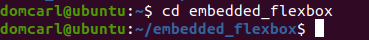
9. Then, type ```code ./``` and press “Enter”. This will open Visual Studio Code with this repo.   
10. In Figure 23, a prompt will appear asking if you want to trust the authors, click “Yes, I trust the authors”.
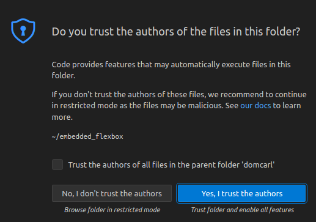
11. Next, open and type in a VS Code terminal ```alr build``` and press “Enter”. Doing so will install all of the necessary dependencies and packages needed to run the repo on the STM32F7 discovery board.  
12. Lastly, establish the OpenOCD connection by typing the command ```openocd -f /usr/share/openocd/scripts/board/stm32f7discovery.cfg -c 'program bin/embedded_flexbox verify reset exit'``` as depicted in Figure 24 into the VS Code terminal. Once it is typed up, press “Enter”.
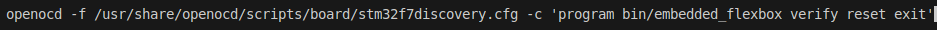
13. You should see the board flash its screen to white; then after several seconds, you should see the current configuration of embedded_flexbox.

## Additional Notes

For Penn State World Campus SWENG 480/481 Capstone Project Fall 2023 - Spring 2024

---

Happy Coding with Ada!
